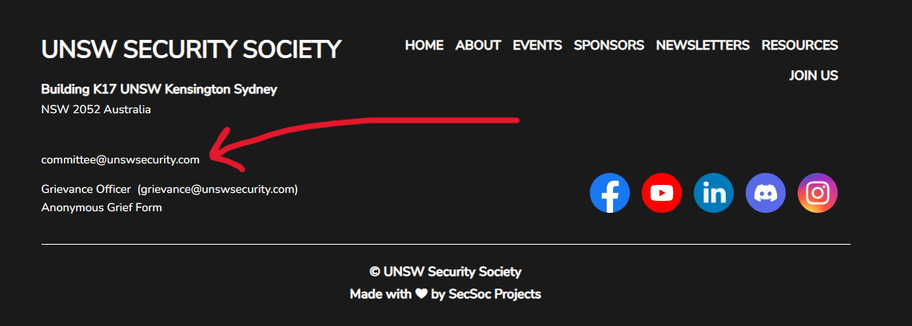
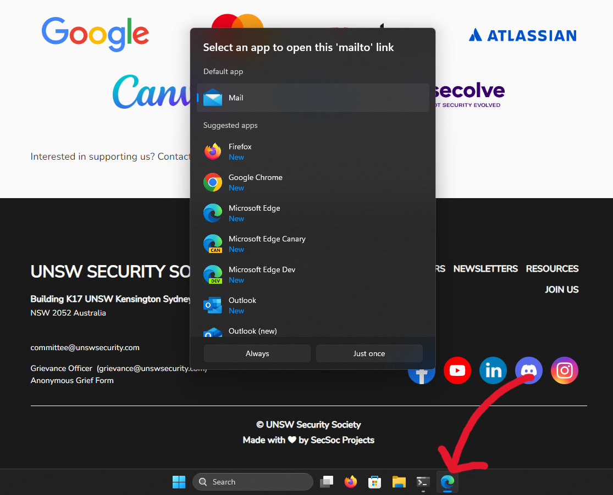

# Writeup for `order here*`

| author | category | value |
|--------|----------|-------|
| mtnull |   misc   |   25  |

We'll be serving a delicious SecSoc website with some high-end kiosks during our O-Week store (get it?) at the Quadrangle Lawn. Come on over and order a SecSoc website!

**Note**: Only available on Monday and Tuesday.

| cost |                         content                          |
|------|----------------------------------------------------------|
|  0   | Click on everything you see and you might strike gold :) |

## Solution

Click here to reveal the solution!

### The Big Idea

Kiosk escaping by exploiting the mailto prompt on Windows.

### Walkthrough

1. Scroll down to the footer of the SecSoc website.
2. Click on the "committee@unswsecurity.com" email:

3. Clicking this email will show a prompt requesting you to choose a default app to open emails. Exploit this by closing Microsoft Edge, which will take you to the desktop of the kiosk where the flag resides:

### Flag(s)

- `OWEEK{htm1_t4st3s_n1c3}`

